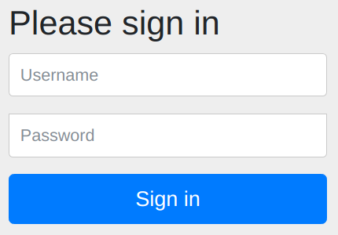

= Adding Spring Security

Adding Spring Security to an existing application can be quite a daunting prospect.
Merely adding the required dependencies to your project sets off a chain of events which can break your application and tests.

Maybe you're suddenly shown a login prompt which expects a generated password logged on startup. +
Maybe your tests now get the dreaded `401 Unauthorized`, or a subsequently a `403 Forbidden`. +
Maybe you get a `ClassCastException` when trying to use your `Authentication#getPrincipal()`. +
Either way, this post is here to help!

We will walk you through adding Spring Security to an existing application,
by explaining what happens when you first add the dependencies, what to do next, and how to fix your tests.

== Our initial application
To showcase adding Spring Security we've developed a small application, along with some tests of it's functionality.
Imagine a Human Resources department that has a small application to track and approve/deny leave requests.
Initially this application was only used from within the HR department, who received requests via phone or email.

Now we want to open up this application to all employees, so they can file their leave requests themselves.
Anyone from the HR department can then either approve or deny a leave request.
Simple enough! For a version of our application without any security in place have a look at https://github.com/timtebeek/spring-security-samples/tree/master/adding-spring-security/leaveapp-initial[leaveapp-initial].

== Which dependency to add?
The first step in adding security to our application is picking the right dependency to add to our project.
However, even figuring out which dependency to add can be difficult these days!
Looking at https://start.spring.io/#!type=maven-project&&jvmVersion=11&dependencies=security,oauth2-client,cloud-security,cloud-oauth2,oauth2-resource-server[start.spring.io]
we can see there are already 5 different dependencies related to Spring Security and/or OAuth2.
In part this is down to a https://spring.io/blog/2019/11/14/spring-security-oauth-2-0-roadmap-update[restructuring of OAuth2 support],
with OAuth2 resource server and client support now https://github.com/spring-projects/spring-security/wiki/OAuth-2.0-Features-Matrix[moved into Spring Security 5.2+].

In short we now advise against using the Spring Cloud Starter dependencies, and push towards using Spring Security support for OAuth2.

If your service will act as an OAuth2 resource server, by accepting JSON Web Tokens passed in from a gateway, you can use `spring-boot-starter-oauth2-resource-server`.
We expect this to be the most common form within a micro-services landscape, where a central gateway assumes the OAuth2 client role.
It is also what we will use throughout this blog post, although much of the details below apply to other forms as well.

If your service will act as an OAuth2 client to acquire JSON Web Tokens, you'll most likely want to use `spring-boot-starter-oauth2-client`.

Both starters will provide you with any transitive dependencies you might need for the most common security aspects.

== What happens when you add the dependency?
We add a dependency on `spring-boot-starter-oauth2-resource-server` to our initial application.
Then we start our application by running `LeaveRequestApplication`, and point our browser towards `http://localhost:8080/view/all`.
Now before adding the dependency this endpoint would show all the leave requests for all employees.
After adding the dependency, this endpoint now throws up a sign in dialog, which we certainly never configured!

If we try to open the same endpoint from the commandline we immediately get a `HTTP/1.1 401` response.

We turn to the application logs to find out what happened in our application.
As it turns out, there's a curious new logline from https://github.com/spring-projects/spring-boot/blob/2.2.x/spring-boot-project/spring-boot-autoconfigure/src/main/java/org/springframework/boot/autoconfigure/security/servlet/UserDetailsServiceAutoConfiguration.java[`UserDetailsServiceAutoConfiguration`]:
[source,text]
----
INFO --- [main] .s.s.UserDetailsServiceAutoConfiguration : 
  Using generated security password: fcf786f4-797b-499b-9abc-2cee4037edb3
----
This auto configuration triggers when no other security configuration has been provided.
It sets up our application with a default user and generated password, as a fallback of sorts.
After all, if you're adding Spring Security to your class path you will want some form of security.
At the very least the log line and dialog serve as a reminder to configure exactly what you want in your application.

=== OAuth2 Resource server configuration
Since we wish to configure our application to function as an OAuth2 resource server, we can provide the required configuration to make the generated security password go away.
https://docs.spring.io/spring-security/site/docs/5.2.x/reference/html/oauth2.html#oauth2resourceserver[As indicated in the documentation], configuration takes the form of:

.application.yml
[source,yaml]
----
spring:
  security:
    oauth2:
      resourceserver:
        jwt:
          issuer-uri: http://localhost:8090/auth/realms/spring-cloud-gateway-realm
----
Our application will now call out to the configured `issuer-uri` during startup, to configure the `JwtDecoder`.
During development we will either link:keycloak/README.adoc[use Keycloak] or link:keycloak/README.adoc[WireMock] to serve the configured `issuer-uri` endpoint.

Once this configuration is in place we can restart our application.
Looking at the logs we no longer see the generated password; Great!
The `UserDetailsServiceAutoConfiguration` from before has instead been replaced by https://github.com/spring-projects/spring-boot/blob/2.2.x/spring-boot-project/spring-boot-autoconfigure/src/main/java/org/springframework/boot/autoconfigure/security/oauth2/resource/servlet/OAuth2ResourceServerJwtConfiguration.java[`OAuth2ResourceServerJwtConfiguration`], which has provided us with a `JwtDecoder` to handle incoming tokens.
Unless you provide your own `WebSecurityConfigurerAdapter`, this sets up your application to required a JSON Web Token for each request.

When we now call any application endpoint we consistently get a `401 Unauthorized` response, since our requests lack an `Authorization` header with  `Bearer` JSON Web Token.
To solve this, we have to actually pass a Bearer token along with our requests.
Here's a token and https://httpie.org[HTTPie] command to get your request through with a `HTTP/1.1 200`:

.Click to show full JSON Web Token
[%collapsible]
====
eyJhbGciOiJSUzI1NiIsInR5cCIgOiAiSldUIiwia2lkIiA6ICJRSS1mdW1sLTRyTnBrdVZxWVg0elpuZlRUZW1hSkxoZ183Z0dULTZiSFlVIn0.eyJqdGkiOiI0OWFkZmVlOS02MGEwLTQxMTItOGI1OS1hZWEwOTliYjlmYTIiLCJleHAiOjE2NTk4OTg3NjYsIm5iZiI6MCwiaWF0IjoxNTczNDk4NzY2LCJpc3MiOiJodHRwOi8vbG9jYWxob3N0OjgwOTAvYXV0aC9yZWFsbXMvc3ByaW5nLWNsb3VkLWdhdGV3YXktcmVhbG0iLCJhdWQiOiJhY2NvdW50Iiwic3ViIjoiYWQ4MjRkZmMtNmFmZi00NWEzLWJlOWQtOTU0ZDUwZmJkYjdhIiwidHlwIjoiQmVhcmVyIiwiYXpwIjoic3ByaW5nLWNsb3VkLWdhdGV3YXktY2xpZW50Iiwibm9uY2UiOiJwMGtsejZlc0VYNnYtWU8tXzVGd2JITk95N2NudklibEsweTBiWi1iUVpNIiwiYXV0aF90aW1lIjoxNTczNDk4NzY2LCJzZXNzaW9uX3N0YXRlIjoiZjIyMjY4ZTAtOTJlZS00MDU4LTgzMzctMzkyNDg4YjJlNTQwIiwiYWNyIjoiMSIsInJlYWxtX2FjY2VzcyI6eyJyb2xlcyI6WyJvZmZsaW5lX2FjY2VzcyIsInVtYV9hdXRob3JpemF0aW9uIl19LCJyZXNvdXJjZV9hY2Nlc3MiOnsiYWNjb3VudCI6eyJyb2xlcyI6WyJtYW5hZ2UtYWNjb3VudCIsIm1hbmFnZS1hY2NvdW50LWxpbmtzIiwidmlldy1wcm9maWxlIl19fSwic2NvcGUiOiJvcGVuaWQgcGhvbmUgbWljcm9wcm9maWxlLWp3dCBvZmZsaW5lX2FjY2VzcyBwcm9maWxlIGVtYWlsIGFkZHJlc3MiLCJ1cG4iOiJhbGljZSIsImVtYWlsX3ZlcmlmaWVkIjp0cnVlLCJhZGRyZXNzIjp7fSwibmFtZSI6IkFsaWNlIiwiZ3JvdXBzIjpbIm9mZmxpbmVfYWNjZXNzIiwidW1hX2F1dGhvcml6YXRpb24iXSwicHJlZmVycmVkX3VzZXJuYW1lIjoiYWxpY2UiLCJnaXZlbl9uYW1lIjoiQWxpY2UifQ.hHK8E-01eFb4UZtBjclVronp-6jfVbhxh9U0m0DEdYQE8YGWFCjMxUcfeI0Rx9zueeC_HJsFT4wcegs8Qh6Z2n7IGWbf0Vtg0fzVH9vFXkwbFBdbCZJz4MZ1Zc3cpC2UrSnuPDc8EIn1FQrKIEF8nqEcNzcL3ujxligvOern2A4xUS1GLqrLKmbPPbKocESZb75EMbmEPFDoctgI1n4vniOz9j242WxbcMjM7INeIsPCKWqvgaeYHOKlgW2CfHfsLPr_XQw5VvCMWJ1GHficCwwjyL-PeemHmBS6eO6EnHpl5Ftm7siATcZuJXQHTosb6b38Gkw2s6-yGQJcbQc01g
====
[source,bash]
----
# Save the token in an environment variable
$ export token=eyJhbGc...
# Create a leave request for a specific user and time window
$ http POST ':8080/request/tim?from=2020-03-21&to=2020-04-11' "Authorization: Bearer ${token}"
# Retrieve all leave requests
$ http :8080/view/all "Authorization: Bearer ${token}"
----
Perfect! Now we have the basics in place to pass our authentication to our application.

=== Fixing our tests; part 1
Now we have an application that requires an OpenID Connect provider on startup, and a valid JWT for any request.
Neither plays well with the tests we have, so we're going to have to fix each of the different test flavors we have.

We've added four different types of tests which each use a full or partial Spring application context, to simulate what you might find in an existing application.
They are identified below using the annotation and argument that bootstraps the test application context.
We'll go over each test and the changes needed to make them pass again.

==== @WebMvcTest with controller
First up we wish to make `LeaveRequestControllerWebMvcTest` pass again; We're testing the controller in isolation here, using `@WebMvc` together with `MockMvc`.
Running the tests we see `GET` requests now get a `401 Unauthorized` response, while `POST` requests get a `403 Forbidden` response.

- The `401 Unauthorized` response on `GET` requests we get because we're not yet passing an `Authorization: Bearer eyJ...` header in our tests.
- The `403 Forbidden` response takes a little more diving into; Debug logging points us in the right direction:
[source,text]
----
DEBUG --- [main] o.s.security.web.csrf.CsrfFilter :
  Invalid CSRF token found for http://localhost/approve/4570ec01-9640-4873-a75b-59a8b4983d9e
----
By default Spring Security adds https://docs.spring.io/spring-security/site/docs/5.2.x/reference/htmlsingle/#servlet-csrf[Cross Site Request Forgery] protection for `POST` requests.
This protects our resource server from malicious requests; and we choose not the disable this just yet.
Because of this, we have to add `csrf` tokens to our POST requests, which is normally provided through a `CsrfRequestPostProcessor` from `spring-security-test`.

We want to authenticate for our web requests, which we can achieve by adding the https://docs.spring.io/spring-security/site/docs/5.2.x/reference/html/test.html[`spring-security-test`] library to our test class path.
This library provides us with `SecurityMockMvcRequestPostProcessors#jwt()`, among others, which we add to our test methods to have them pass a valid JWT along to each request.
[source,java]
----
mockmvc.perform(get("/view/id/{id}", UUID.randomUUID())
  .with(jwt().jwt(builder -> builder.subject("Alice"))))
  .andExpect(status().isOk())
----
Coincidentally, this also already resolves the CSRF issue with POST requests.
If you now rerun the tests, you'll find all tests within `LeaveRequestControllerWebMvcTest` pass again!

==== @SpringBootTest with WebEnvironment.MOCK
Next up is our `LeaveRequestControllerSpringBootWebEnvMockTest`, which now requires Keycloak to start the application context.
While locally this might be manageable, for CI/CD environments and general test stability it's far from ideal.
Therefore we would like to make this test pass without the need for the configured `issuer-uri` to be available.
We can achieve this fairly easily by providing a `@MockBean JwtDecoder`, which bypasses the call to our `issuer-uri`, https://docs.spring.io/spring-security/site/docs/5.2.x/reference/htmlsingle/#literal-authentication-literal-literal-requestpostprocessor-literal[as alluded to in the documentation].
With the MockBean in place we can see the test application context now starts up again, even when the OpenID Connect provider is unavailable.

At this point we see the same failure modes as we saw previously: `GET` requests get a `401` response, wehereas `POST` requests get a `403` response.
We add the same fixes as previously applied to `LeaveRequestControllerWebMvcTest` to make all tests pass again.

==== @SpringBootTest with WebEnvironment.RANDOM_PORT
Our `LeaveRequestControllerSpringBootWebEnvRandomPortTest` puts as in quite a difficult spot;
There's no clear route to easy test support for this approach, and we have to wonder if this is the best way to write application tests at all.
But, since we're not giving up easily, there's still a way to get things working, even if it shows you maybe shouldn't.
We start out by manipulating Keycloak to give us a JSON Web Token with a ridiculously long lifespan; It's the same token as you've seen before above.
Next, we add `spring-cloud-contract-wiremock` to our test class path, and wire it up to serve our recorded Keycloak OpenID Connect mappings during our tests.
Finally, we add a `RestTemplateCustomizer` which appends the JWT to any test requests.

This approach might not be feasible for your OpenID Connect provider, it might not scale as you need different roles and tokens, and in general seems like a bad idea.
There's little in terms of alternatives though, save for further test application context hacks which defeat your testing of token handling.

== Roles and authorizations
Our application now requires a JWT with every request, and decodes that into an Authentication.
While this is all fine and needed; it does not yet achieve much in terms of security; anyone can authenticate, file and view leave requests and approve or deny them as they see fit.
We need to configure our application with some common sense roles and restrictions.
For instance:

- we want users to only submit and view requests for themselves;
- only HR employees can approve or deny requests, and view all requests.

=== Configuring method security
Since all requests pass through our `LeaveRequestService`, this seems like the perfect place to add our security restrictions.
We'll add a variety of security annotation and expressions, all of which are documented extensively in https://docs.spring.io/spring-security/site/docs/5.2.x/reference/html/authorization.html[the Authorization chapter of Spring Security].
The security annotations need to be enabled through `@EnableGlobalMethodSecurity(prePostEnabled = true, jsr250Enabled = true)`, as without this annotation they fail to enforce anything!

[source,java]
----
@PreAuthorize("#employee == authentication.name or hasRole('HR')")
public List<LeaveRequest> retrieveFor(String employee) {
  return repo.findByEmployee(employee);
}

@RolesAllowed("HR")
public List<LeaveRequest> retrieveAll() {
  return repo.findAll();
}
----

=== Fixing our tests; part 2
Now that we've added security restrictions, we have to do another round of test fixes to match our security restrictions.
Our test user name should now match the employee name for leave requests submitted or viewed.
To approve or deny leave requests, the active user should have the "HR" role.

==== @SpringBootTest with WebEnvironment.NONE
Our `LeaveRequestServiceTest` methods now also need an active user, where this was not needed before.
We use the same `@WithMockUser` as we've seen earlier, with arguments added to match either the required user name, or the required "HR" role.
[source,java]
----
@Test
@WithMockUser(username = "Alice")
void testRequest() {
  LeaveRequest leaveRequest = service.request("Alice", of(2019, 11, 30), of(2019, 12, 03));
  verify(repository).save(leaveRequest);
}

@Test
@WithMockUser(roles = "HR")
void testApprove() {
  LeaveRequest saved = repository.save(new LeaveRequest("Alice", of(2019, 11, 30), of(2019, 12, 03), PENDING));
  Optional<LeaveRequest> approved = service.approve(saved.getId());
  [...]
}
----

==== @SpringBootTest with WebEnvironment.MOCK
Similar to `LeaveRequestServiceTest`, we also need to define the same mock user attributes here as we did for our `@WebMvcTest`.

==== @SpringBootTest with WebEnvironment.RANDOM_PORT
Proving ever more troublesome, we have to make some more substantial changes to `LeaveRequestControllerSpringBootWebEnvRandomPortTest`.
We need a second token for a user with the `HR` role to be able to test the approve/deny flows.
So we again manipulate Keycloak to give us another token with the specified role, and pass that in the relevant tests.
We can no longer use the `RestTemplateCustomizer` from before, and instead have to use `TestRestTemplate#exchange()` within each test.
With our tests updated and rerun, we find our token handling to be incomplete!

By default our tokens are decoded to have a UUID username, and the Keycloak realm access roles are not mapped at all yet.
None of the other test approaches surfaced this omission, so there's some value to these tests after all.

To provide the missing functionality we add a `UsernameSubClaimAdapter` and `KeycloakRealmRoleConverter`, which we wire up in `SecurityConfig`.
These details will differ per OpenID Connect provider, along with any configured roles.

== Conclusion
We have now added Spring Security to our application, to allow any user to authenticate, while only granting some users special privileges.
The full source code with Spring Security added can be found in https://github.com/timtebeek/spring-security-workshop/tree/master/adding-spring-security/leaveapp-complete[leaveapp-complete].
This application could of course be expanded to include further protection against exploits, auditing and even more security aspects, but we leave those for another time.
